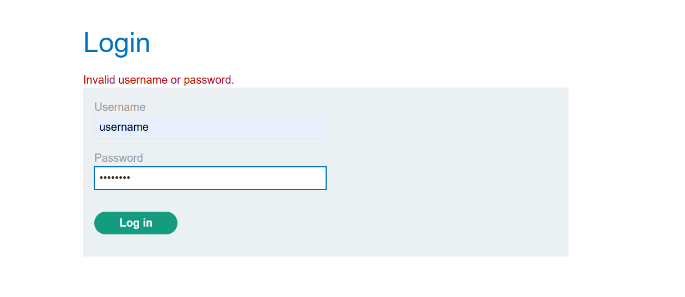
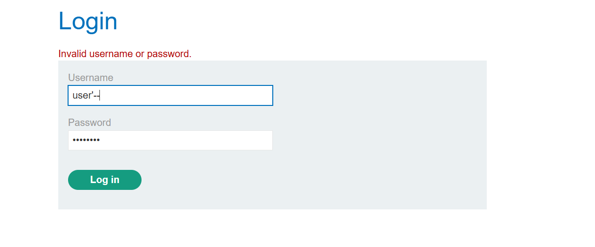
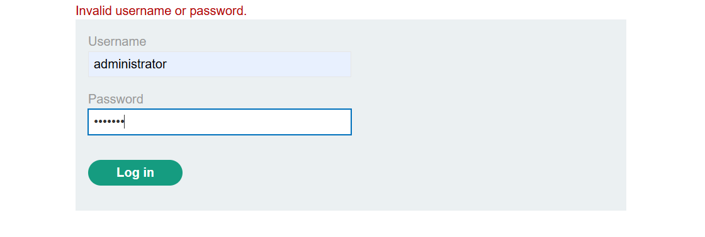
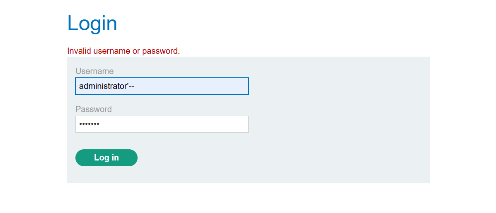
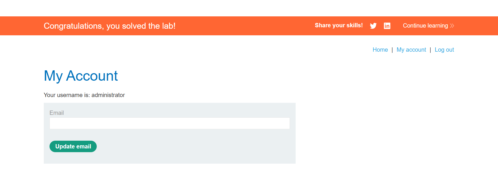

## Lab: SQL injection vulnerability in WHERE clause allowing retrieval of hidden data

## Objective
This lab contains a SQL injection vulnerability in the login function.

To solve the lab, perform a SQL injection attack that logs in to the application as the administrator user.

## What (understanding the vulnerability)

SQL injection is a vulnerability where unsanitized user input is interpreted as part of an SQL query. In this lab, the injected payload modifies the WHERE clause, causing the application to bypass authentication.

## Why (why it exists and why the exploit works)

The vulnerability exists because user input is concatenated directly into an SQL query without proper validation or parameterized queries. The injected (comment sequences --) are used for bypassing access controls or retrieving unauthorized data.

## Where (where the vulnerability is found)

It is found in the login page of the web application.

SELECT * FROM users WHERE username = 'administrator'--' AND password = ''

## When (when the attack is applicable)

This attack is possible whenever user input is directly included in a login query without proper validation or parameterized queries.

## Who (who can exploit it and who is affected)

Any attacker who can interact with the vulnerable application can exploit this flaw. Several credentials can be compromised.

## How (step-by-step solution, payloads, and screenshots)
1. Navigate to the My Account section to access the application's login page.

2. Enter random credentials to observe the normal login behaviour.

3. In the Username field, enter the SQL injection payload administrator'--

4. The comment sequence helps to bypass the password check and successfully login as the administrator.

## Key Takeaways

Using -- to remove the password check from the where clause of the query.

User input should never be directly concatenated into SQL queries.

## References

WebSecurity Academy SQL Injection 

https://www.youtube.com/c/RanaKhalil101/playlists