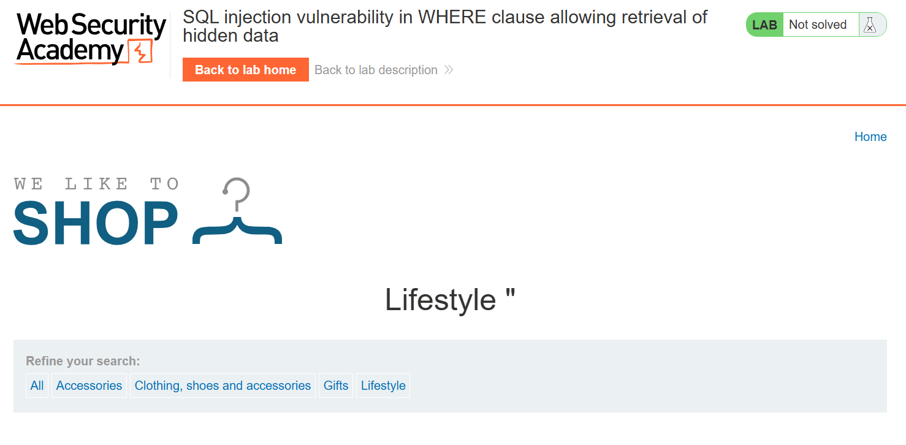
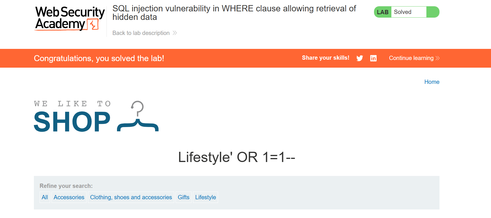

## Lab: SQL injection vulnerability in WHERE clause allowing retrieval of hidden data

## Objective
To solve the lab, perform a SQL injection attack that causes the application to display one or more unreleased products.

## What (understanding the vulnerability)

SQL injection is a vulnerability where unsanitized user input is interpreted as part of an SQL query. In this lab, the injected payload modifies the WHERE clause, causing the application to return hidden or unintended data.

## Why (why it exists and why the exploit works)

The vulnerability exists because user input is concatenated directly into an SQL query without proper validation or parameterized queries. The injected condition (OR 1=1) always evaluates to true, causing all matching rows, including hidden products, to be returned.

## Where (where the vulnerability is found)

It is found in the category parameter of the product filter, which is directly used in the SQL WHERE clause.

## When (when the attack is applicable)

This attack is applicable whenever user-controlled input is included in SQL queries without proper sanitization or parameterized statements.

## Who (who can exploit it and who is affected)

Any attacker who can interact with the vulnerable application can exploit this flaw. Organizations and users whose data is stored in the affected database are impacted.

## How (step-by-step solution, payloads, and screenshots)
1. Observe the URL parameter.

2. Submit sql specific characters such as ' or " to look for anomalies 

3. Injecting Gifts'+OR+1=1-- in the url (to get the unreleased products)

## Key Takeaways

The OR 1=1 condition bypasses intended filters.

User input should never be directly concatenated into SQL queries.

## References

WebSecurity Academy SQL Injection 
https://www.youtube.com/c/RanaKhalil101/playlists